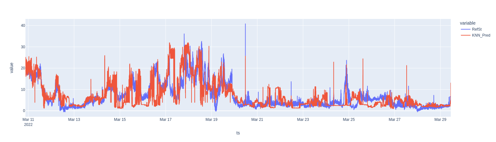

# Calibration of sensors in an Uncontrolled Environment under Sounds of New York City Project.

The objective of the project is to calibrate an Air Quality Sensor ie AQSensor by using different method such as _Machine Learning_ and _Neural Network_:

1. Multiple Linear Regression (MLR)
2. K-Nearest Neighbour (KNN)
3. Random Forest (RF)
4. Kernel Regression (KR)
5. Gaussian Process (GP)
6. Support Vector Regression (SVR)
7. Neural Netwok (NN)

## About

This project is developed under New York University at Center of Urban Sciences and Progress.

The Data is organized as follows:

1. RefSt: Reference value of highly calibrated Sensor Praxis_Data_pm2.5.
2. Sensor_01: Canary_Data_pm2.5 Sensor which need to be calibrated.
3. Temp: Temperature Data from Canary_sensor.
4. RelHum: Relative Humidity from Canary_sensor.

## Data Calibration

A data calibration process was done using the network of three sensor data (_Canary_Data_, _RelHum_, _Temp_) will be trained against reference data _RefSt_ using different regression algorithm.

For this process, the main dataset is splitted into 60% training set and 40% test set. Given that the dataset contains data from 50 days with 1 min timestamp. The **data does have sesonality**, This is why data split is made without shuffling.

To check performance and later compare them, some **regression loss function** values are calculated for each method:

- _Coefficient of determination_ R2: determines to what extent the variance of one variable explains the variance of the second variable
- _Root-mean-square error_ RMSE: the standard deviation of the residuals (prediction errors)
- _Mean absolute error_ MAE: a measure of errors between paired observations expressing the same phenomenon

### Multiple Linear Regression

The most widely used equation to predict levels of Air Quality is a linear combination of the following independent variables:

Pred = β0 + β1·Sensor_O3 + β2·Temp + β3·RelHum

By using `sklearn`'s linear regression fit function, we obtain the values:

Intercept:
0.6723677017929273
Coefficients:
[-0.00057884 0.06809885 0.11411421]
0.08562066689158321

Loss functions:

- R-squared = 0.07554861131433477
- RMSE = 31.770639431890228
- MAE = 4.286662864655335

### Stochastic Gradient Descent

Stochastic Gradient Descent is well suited for regression problems with a large number of training samples (>10.000), authough it is suitable for smaller sets.

We obtain the values:
The data has to be normalised to run a SGD algorithm.

Intercept:
[6.49759358]
Coefficients:
[-0.11402433 0.5023743 1.64841827]
Iters:
5
{'alpha': 0.0001, 'average': False, 'early_stopping': False, 'epsilon': 0.1, 'eta0': 0.01, 'fit_intercept': True, 'l1_ratio': 0.15, 'learning_rate': 'invscaling', 'loss': 'squared_loss', 'max_iter': 5, 'n_iter_no_change': 5, 'penalty': 'l2', 'power_t': 0.25, 'random_state': None, 'shuffle': True, 'tol': 0.001, 'validation_fraction': 0.1, 'verbose': 0, 'warm_start': False}

Loss functions:

- R-squared = 0.07084816845819308
- RMSE = 31.93217964588136
- MAE = 4.315783521089843

### K-Nearest Neighbor

K-Nearest Neighbor takes the k-nearest data points and averages them to create a regression (or classification, for other applications). Choosing the right _k_ (number of neighbors) is key to find the best approximation.

For a KNN regression, the hyperparameter to be set is the **number of neighbors** (_k_). To tune this parameter, some performance stats are calculated: **R2**, **RMSE**, **MAE**, and **time to solve** (in ms). These parameters are plotted against the number of estimators _k_, which ranges from 1 to 150.

There are also some guidelines to choose the optimal value of _k_. It is recommended to choose _k ≈ sqrt(n)_, being _n_ the size of the train dataset. The following rules should be fulfilled:

- _k_ value should be odd
- _k_ value must not be multiples of the number of classes
- should not be too small or too large

Increasing _k_ too much will tend to smooth graph boundaries and will avoiding overfitting at the cost of some resolution on the predicted output.

We obtain Loss function:

- R-squared = 0.4226790761125174
- RMSE = 19.84079978006459
- MAE = 2.9894099874231705

### Random Forest

Random Forest is an ensemble method for regression that combines the predictions from multiple machine learning algorithms. It returns the mean or average prediction of the individual trees to make predictions. The trees in random forests run in parallel, having no interaction among trees when building them.

The obtained loss functions for Random Forest with the hyperparameters specified above are:

Loss functions:

- R-squared = 0.6535566226985347
- RMSE = 11.906226502033737
- MAE = 2.209257117832554

Feature importances:
[('Sensor_O1', 0.5575974512748697), ('Temp', 0.365309493437055), ('RelHum', 0.07709305528807543)]

### Kernel Regression

Two kernel regression methods are tested:

- Radial basis function kernel (RBF)
- Polynomial kernel

Polynomial kernel has one hyperparameter, which is the **polynomial degree**.

### Support Vector Regression

Support Vector Regression is used with three kernels:

- RBF

Intercept:
[1.68250378]
Loss functions:

- R-squared = -0.5972593542982951
- RMSE = 54.89304429167744
- MAE = 4.36074889732449

- Linear
- Polynomial, degree 3

### Neural Network

The Neural Network model is developed using `tensorflow`'s libraries. There are some hyperparameters to tune: _number of hidden layers_, _neurons per layer_, _epochs_ (number of complete passes through the training dataset) and _batch size_ (number of training samples to work through before the model's internal parameters are updated).

For the number of hidden layers, the recommended relation is:

Nh = Ns/(α∗ (Ni + No))

Where:

- Nh is number of hidden layers
- Ns is size of the dataset
- Ni is number of input neurons
- No is number of output neurons
- α is an arbitrary scaling factor (from 2 to 10)

The activation function that has been used is `ReLU`, as it it makes the model easy to train and achieves a good performance.

The optimizer that has been used is `adam`, a stochastic gradient descent method that is able to handle sparse gradients on noisy problems, like the case of data gathered form sensors.

The training process has to be done with normalised values of the data.

Loss functions:

- R-squared = 0.021207725849813674
- RMSE = 33.638173733458544
- MAE = 3.8195544433765534

## Results summary

The table below shows the performance results of each method obtained in the calibration process:

|                          Method                          |  R2   |       RMSE       |       MAE        |
| :------------------------------------------------------: | :--------------: | :--------------: | :--------------: |
|          Multiple Linear Regression (equation)           |      0.0755      |      31.770      |      4.2866      |
| Multiple Linear Regression (Stochastic Gradient Descent) |      0.0708      |      31.932      |      4.3157      |
|                    KNear--st Neighbor                    |      0.4226      |      19.840      |      2.9890      |
|                      Random Forest                       |      0.6535      |      11.906      |      2.2095      |
|         Radial Basis Function Kernel Regression          | RAM exceed error | RAM exceed error | RAM exceed error |
|          Polynomial Function Kernel Regression           | RAM exceed error | RAM exceed error | RAM exceed error |
|          Radial Basis Function Gaussian Process          | RAM exceed error | RAM exceed error | RAM exceed error |
|          Dot Product Function Gaussian Process           | RAM exceed error | RAM exceed error | RAM exceed error |
|     Radial Basis Function Support Vector Regression      |      0.5972      |      54.893      |      4.3607      |
|             Linear Support Vector Regression             |        -         |        -         |        -         |
|           Polynomial Support Vector Regression           |        -         |        -         |        -         |
|                      Neural Network                      |      0.021       |      33.63       |      3.819       |

Regarding the results, the top three regression methods according to their prediction performance are:

|       Method       | R2 |  RMSE  |  MAE   |
| :----------------: | :-----------: | :----: | :----: |
|   Random Forest    |    0.6535     | 11.906 | 2.2095 |
| KNear--st Neighbor |    0.4226     | 19.840 | 2.9890 |
|   Neural Network   |     0.021     | 33.63  | 3.819  |

## References

Pandas documentation [pandas.pydata.org/docs/](https://pandas.pydata.org/docs/)  
Sklearn documentation [scikit-learn.org/stable/modules/classes.html](https://scikit-learn.org/stable/modules/classes.html)  
Tensorflow documentation [tensorflow.org/api_docs/python/tf](https://www.tensorflow.org/api_docs/python/tf)
